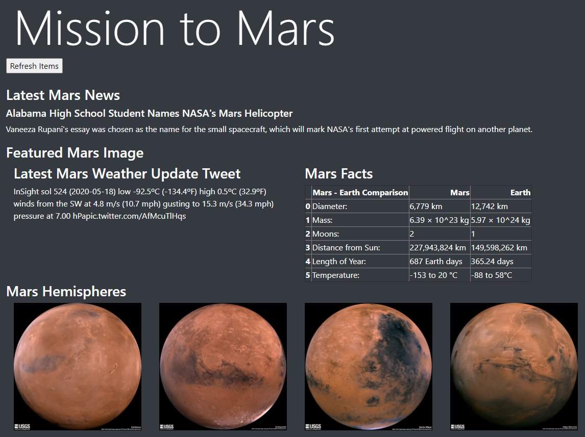

# Mission to Mars
This project is a part of the [Data Science Bootcamp](https://bootcamp.pe.gatech.edu/data/) at [Georgia Tech](https://bootcamp.pe.gatech.edu/).

#### -- Project Status: [Active - Twitter Scrape Section Not Working]

## Project Intro/Objective
The purpose of this project is to gather media and information relating to Mars from multiple websites and compile it in one destination.

### Methods Used
* Web Scraping
* Webpage Design
* Flask App
* Database Creation

### Technologies
* Python
* Flask
* MongoDB
* Pandas, jupyter
* HTML
* JavaScript
* Beautiful Soup
* Splinter

## Project Description
The Mission to Mars app works as a single destination to get all the Mars information you need. The app was built using Flask in Python. The app creates a Mongo database to store the data that will scraped. At the home route, you can view a webpage of all the data, and the /scrape route will run the scraper code to refresh the data.

The scraper code is the bulk of the project. Using Beautiful Soup, the weather, news, facts, and image URLs were scraped from various web pages. Mars.nasa.gov stays updated with the latest Mars news, and @MarsWxReport Twitter feed provides a daily weather report from the weather instrument aboard the Curiosity rover. The most recent news article and most recent tweet are all that we need. Facts about Mars were pulled from space-facts.com. Image URLs were obtained from scraping NASA and USGS websites. Splinter was used to navigate to each source between scrapes.
Upon retrieval of the data, it's compiled in a dictionary format and returned to the Flask app. The app stores the dictionary of Mars data into a Mongo database. The app will then be able to render the newly stored data using an HTML template.

## Getting Started

1. Clone this repo (for help see this [tutorial](https://help.github.com/articles/cloning-a-repository/)).
2. Raw Data is found at the following links:
    - https://mars.nasa.gov/news/
    - https://www.jpl.nasa.gov/spaceimages/?search=&category=Mars
    - https://twitter.com/marswxreport?lang=en
    - https://space-facts.com/mars/
    - https://astrogeology.usgs.gov/search/results?q=hemisphere+enhanced&k1=target&v1=Mars
3. Data processing/transformation scripts are being kept [here](https://github.com/joja92/web-scraping-challenge/tree/master/Mission_to_Mars)
4. Python with following libraries installed required to run: flask, pymongo, requests, bs4, time

## Contributing Members

**[Joseph Ayala](https://github.com/joja92)**

## Contact 
* Feel free to contact me with any questions or if you are interested in contributing!